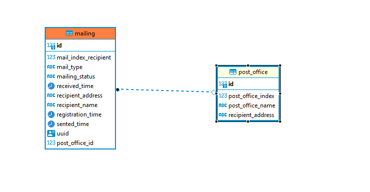

Тестовое задание Skyeng (Горшков Алексей)

Swagger Api Documentation - api-documentation (1).pdf

База данных использовалась Н2 с параметрами (также используется data.sql скрипт для заполнения таблицы PostOffice 
для проверки работы API):

datasource:
url: jdbc:h2:~/sk
username: sa
password: sa

jpa:
defer-datasource-initialization: true
hibernate:
ddl-auto: update
show-sql: true
h2:
console:
enabled: true
path: /h2

Запросы и эталонные JSON:

Регистрация нового почтового отправления
```
POST /mailing/registration
```
```
{
"mailType":"LETTER",
"mailIndexRecipient":"460000",
"recipientName":"Alex",
"recipientAddress":"Moscow",
"postOffice":{
    "id":5
}
}
```

Убытие почтового отправления из отделения
```
PUT /mailing/departure
```

Прибытие почтового отправления в отделение
```
PUT /mailing/arrival
```

Получение отправления получателем
```
PUT /mailing/receiving
```

Просмотр полной истории движения почтового отправления
```
GET /mailing/full
```

Просмотр статуса почтового отправления
```
GET /mailing/status
```


Схема данных
Выделено 2 сущности по заданию - Почтовое отправление и Почтовое отделение:



Покрытие тестами
Реализованы позитивные и негативные автотесты. Покрытие - 85%. Непокрытыми остались конфиги, main и т.д. Весь функционал по заданию покрыт

Отчёт JaCoCo

Деплой
Приложение собрано в war-архив и запускается с помощью Apache Tomcat 10

Apache Tomcat

Технологии
Стек: Spring
Способ передачи данных: JSON
СУБД: H2
Реализация ORM: Hibernate
Система сборки: Maven